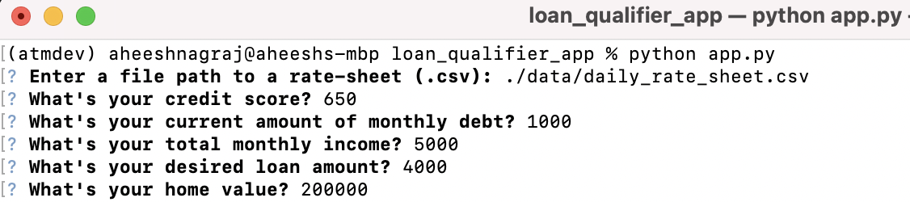

# Loan Qualifier CLI app

This is a command-line interface application for searching qualifying loans across a list of financial institutions. The application asks the user to provide a list of banks and loan products offered. Based on the loan applicant's financial info, the application filters through the available loan options. The result list of banks and loan alternatives can be saved to a CSV file if the user wishes to do so and provides a location path to save the file.

---

## Technologies

This project leverages python 3.7 with the following packages:

* [fire](https://github.com/google/python-fire) - For the command line interface, help page, and entry-point.

* [questionary](https://github.com/tmbo/questionary) - For interactive user prompts and dialogs

---

## Installation Guide

Before running the application first install the following dependencies.

```python
  pip install fire
  pip install questionary
```

---

## Usage

To use the loan qualifier application clone the repository and run the **appy.py** 

```python
python appy.py
```
On launching the loan qualifier application, you will be greeted with the following prompts on the command line interface.


Enter the path to upload a CSV file with banks and loans offered.


Enter Borrowers information
Credit Score
Current amount of monthly debt
Total monthly income
Desired loan amount
Home value


The application will calculate and display the **monthly debt to income ratio** and **loan to value ratio** to help identify qualifying loans for the applicant. 
It will also list the number of loans the applicant qualifies for.


You can now choose to save the list to a CSV file.

If you select no, the list of qualifying loans will be displayed on the interface.


If you select **Yes**, save the results in CSV file. The application will ask for the location to save the file.


The application will display the path of the results file and exit.


---

## Contributors

Application built by Aheesh. Reach me via twitter @aheesh.

---

## License

MIT
